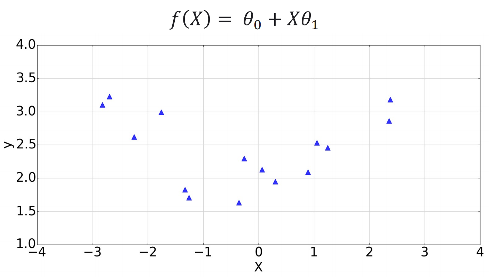
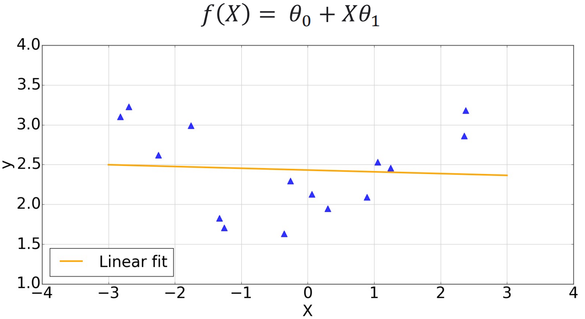

# 数据预处理

### 处理丢失值

当我们的数据集中存在丢失值或错误值时，可以采取平均值或者是舍弃这个样本。

### 处理非数字值

将非数字标签如 France, Germany, Spain 替换为 0,1,2 也可以将没有数学意义的数字标签进行转换.

创建虚拟变量将所有的变量转为binary的，即每个变量仅有0，1两个值.

其中有一个特征有三个变量如 France, Germany, Spain 则转换为3个虚拟变量，如果是France=>[1,0,0], Germany=>[0,1,0], Spain=>[0,0,1]。

NB：但是使用两个值即可表示3个变量，所以可以舍弃一个值。这叫做虚拟变量陷阱。

### 选择特征

可以通过计算相关性来选择相关性更高的特性训练。

### 特征缩放(Scale)

1. MinMax:
   $X'={X-X_{max} \over X_{max} - X_{min}}$
2. Standard
   $X'={X-\mu \over \sigma}$
   其中 $\mu$是均值， $\sigma$是标准差。

### 去相关和白化（decorrelation and whitening）

**通常，数据集的各个attributes是存在一定相关性的，这就意味着存在冗余信息。其实维度约减也是去冗余的一个过程。**

### 数据增强

通过转换现有的样本来增加数据。

如移位、旋转、缩放、扭曲、翻转、改变图像中的对比度。

如修改音频样本的频率和速度。

如在输入特征中添加噪声。

### 扩展(Expansions)

使用线性回归在这个数据集上很难去得到好的效果。如下：

但是可以对数据进行扩展，由 $f(X)=\theta_0+X\theta_1$ 变为 $f(X)=\theta_0+X\theta_1+X^2\theta_2$

这样这个线性回归就可以拟合二次的函数了。

### 正则化

正则化的主要作用是防止过拟合，对模型添加正则化项可以限制模型的复杂度，使得模型在复杂度和性能达到平衡。

L1正则化可以产生稀疏权值矩阵，可以用于特征选择，一定程度上，L1也可以防止过拟合。

L2正则化它对于大数值的权重向量进行严厉惩罚，倾向于更加分散的权重向量；

L2惩罚倾向于更小更分散的权重向量，这就会鼓励分类器最终将所有维度上的特征都用起来，而不是强烈依赖其中少数几个维度。

这样做可以提高模型的泛化能力，降低过拟合的风险。

L1: 减少参数的绝对值总和。

$\sum||W||_1 \leq C$

L2: 减少参数的平方值总和。

$\sum||W||^2_2\leq C$

#### 如何使用正则化

将损失函数转变为成本函数，即加上一个正则化公式。

$J(\theta)=L(\theta)+R(\theta)$

例如:

$RSS(\theta)=||y-X\theta||^2_2+\lambda||\theta||^2_2$

使用L1的是lasso regression，使用L2的是ridge regression。

$\lambda$ 是正则化参数，越大则约束越严格，容易欠拟合，越小则约束越松散，容易过拟合。
