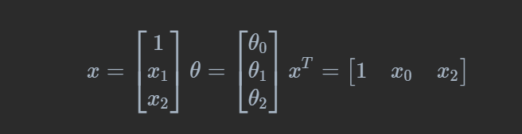
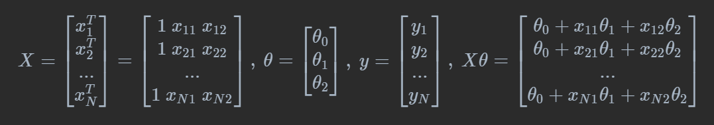

## 回归

根据输入变量的d维向量的值，预测一个或多个连续目标变量的值。

## 线性回归

输入：X

输出：y

寻找可以通过x预测y的线性方程

## 模型定义:

$y={\theta_0}+{\theta_1}x => f(x,\theta) = x^T\theta$

( ${\theta_0}$是偏置, ${\theta_1}$是权重向量, $x$是特征向量)



在这个回归任务中，找到“最佳拟合线”来**最小化预测误差**

使用 $y_i$ 表示数据的实际值， $y_p$表示数据的预测值 ( $y_p=f(X,{\theta})$ )

此处



单个样本的误差为 $|y_i-y_p|$

所以损失函数是 $L({\theta};X,y)={1\over{N}}\sum^N_{i=1}(y_i-f(x_i,\theta))^2={1\over{N}}\sum^N_{i=1}(y_i-\theta^Tx_i)^2$

其中 $L$ 是误差的平方和，进一步变换 $L={1\over{N}}(y-X\theta)^T(y-X\theta)$

## 找到最佳拟合方程

最佳即 $L$ 是最小的，对 $\theta$求偏导， $y$是真实值

设 $e=y-X\theta$ 则 $L=e^Te$

$∇_\theta L={\partial L\over{\partial e}}{\partial e\over{\partial \theta}}$

其中 ${\partial L\over{\partial e}}$ $=∇_e (e^Te)=2e^T$   ${\partial e\over{\partial \theta}}={\partial ({y-X\theta})\over{\partial \theta}}=-X$

因为 $e^Te = e_1^2 + e_2^2 + ... + e_N^2$ 对 $e$ 求偏导等于 $2e_1+2e_2 + ... + 2e_N = 2[e_1 \ e_2 \ ... \ e_N] = 2e^T$

(矩阵求导法则)

$Y=AX=>{{\partial Y}\over\partial X}=A^T $

$Y=XA=>{{\partial Y}\over\partial X}=A $

$Y=AXB=>{{\partial Y}\over\partial X}=A^TB^T $

所以 $∇_\theta L=2e^T(-X)=-2(y-X\theta)^TX$

为了最小化，设该式子等于0 $-2(y-X\theta)^TX=0$

则

因为 $A^TB = B^TA$ 所以 $(y-X\theta)^TX = 0$

$X^T(y-X\theta) = 0$

$X^Ty - X^TX\theta=0$

$X^TX\theta=X^Ty$

$\theta=(X^TX)^{-1}X^Ty$

原因

$AB=C \ => A^{-1}AB=A^{-1}C \ =>B=A^{-1}C$

此时就可以计算出 $\theta$ 向量

代码为

```
import numpy as np
data = np.loadtxt("data.csv", skiprows=1)
x=data[:,1]
y=data[:,2]
x=np.c_[np.ones(len(x)),x] # 设定偏置为1
xt=x.T # X.T
invx=np.linalg.inv(xt.dot(x)) # (X.T@X)^-1
theta=invx.dot(xt).dot(y) # ((X.T@X)^-1)@X.T@y
```

## 虚拟变量陷阱

遇到非数值类型时，需要将其转换为虚拟变量。

虚拟变量的数量等于原来变量的类别数量。

例如国家变量有三个分类：中国，美国和俄罗斯。

则有三个虚拟变量来表示。

虚拟变量陷阱值得是两个或两个以上变量相关联的情况。

例如男性和女性。并不需要两个虚拟变量。当设定女性值为0的时候，男性就会被1表示。

可以使类别变量减一。如有m各类别，使用m-1个虚拟变量。
