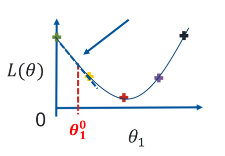
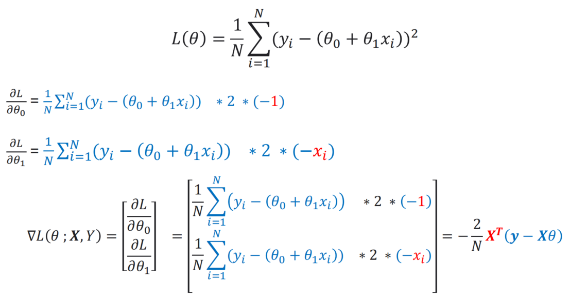
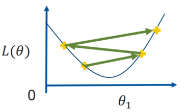
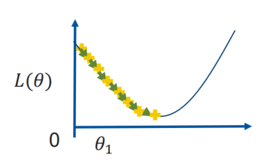
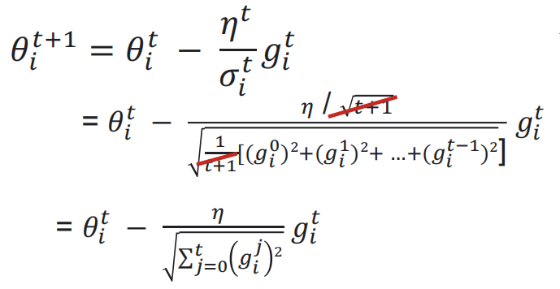

# 梯度下降

梯度可以理解为函数在某一点上的斜率或者说是导数。而机器学习中要找到损失函数 $L$ 的最小值的一种方法就是计算它导数为0的点。

梯度下降指的就是将某个在函数上的点逐步向函数最小值移动，即向斜率为0的点移动。

### 如何做

线性回归的损失函数是 $L(\theta) = {1\over{N}} \sum^N_{i=1}(y_i-(\theta_0+\theta_1x_i))^2$

如果我们使用梯度下降法，如何计算 $\theta$

首先， 假设 $\theta_0$ 是一个常量，计算 $\theta_1$

1. 随机选择 $\theta_1$ 的值，使得 $\theta_1 = \theta^0_1$ ，上标表示迭代次数
2. 计算 ${\partial L\over{\partial \theta_1}}|\theta_1=\theta^0_1$
3. 更新 $\theta_1^1=\theta_1^0-\eta{\partial L \over \partial \theta_1}|\theta_1=\theta_1^0$

这里 $\eta$ 是学习率

不断迭代计算 $\theta_1$ 就可以使得函数接近最小值

同理，我们也可以计算 $\theta_0$ 以及更多的参数。

所以

这里 $∇_\theta L(\theta;X,Y)$ 就是当前 $\theta$ 向量的梯度。

更新：

$\theta^{i+1} =\theta^i-\eta ∇_\theta L(\theta;X,Y) $

### 在线性规划中，梯度下降 VS 等式？

**梯度下降：**

优点：可以在数据集有大量特征的情况下使用

缺点：需要多次迭代，需要设置学习率

**等式：**

优点：不需要迭代，不需要设置学习率

缺点：在数据集特征很多时，会变慢

## 学习率

学习率值得是，点在函数图像上每次移动的距离。

如果学习率太大，梯度下降就会冲过头（好像在两岸悬崖跳跃，而不是快速的掉下去），可能会无法收敛。

如果学习率太小，梯度下降就会很慢。

### 自适应学习率

为了解决上面的问题，我们可以将学习率设置为，可以跟随迭代次数变化。

在最开始使用较大的学习率，快速的靠近目标，然后逐渐的减小学习率，避免过冲。

例如, 设 $t$ 是迭代次数。

$\eta^t = \eta / \sqrt {t+1}$

最理想的情况是，每个参数都有属于自己的学习率，即每个 $\theta$ 都有自己对应的 $\eta$

### 随机梯度下降（SDG）

上面提到的梯度下降算法是批量梯度下降，即对整个数据集进行更新。

随机梯度下降对每个训练样本 $x_i$ 和 $y_i$ 进行参数更新。

SGD算法是**从样本中随机抽出一组，训练后按梯度更新一次，然后再抽取一组，再更新一次，在样本量及其大的情况下，可能不用训练完所有的样本就可以获得一个损失值在可接受范围之内的模型了。**

**一组可以是一个，或是mini batch**

### Adagrad

是一种对每个参数设置不同学习率的算法。

更新频繁的参数有更小的学习率，不频繁的参数有较大的学习率。

使用 $g_i^t$ 表示 $\theta_i^t$ 的梯度，即 $g_i^t={\partial L(\theta^t) \over \partial \theta_i} $

1. 批量梯度下降
   $\theta_i^{t+1}=\theta_i^t-\eta^tg_i^t$
2. Adagrad

   $\theta_i^{t+1}=\theta_i^t-{\eta^t\over{\sigma^t_i}}g_i^t$

这里 $\sigma_i^t = \sqrt {{1\over t+1}[(g_i^0)^2+(g_i^1)^2+...+(g_i^t)^2]}$

化简:

Adagrad算法的缺点是在经过一定次数的迭代依然没有找到最优点时，由于这时的学习率已经非常小，很难再继续找到最优点。

改进算法有 RMSprop 和 AdaDelta。

### 动量

由于SDG会想着局部最优收敛。为了解决这一问题，动量被使用来抑制SDG的振荡。

设动量为 $\gamma$ ，它和物理中的惯性类似。

指的是用历史积累动量来替代真正的梯度。

$v_t = \gamma v_{t-1} + \eta ∇_\theta L(\theta)$

$\theta = \theta + v_t$

动量要小于0。

### Nesterov 加速梯度

Nesterov 加速梯度算法是一种对 Momentum 动量法的改进。它直接用走出去以后前方的梯度来代替动量算法中的当前梯度。

$v_t = \gamma v_{t-1} + \eta ∇_\theta L(\theta- \gamma v_{t-1})$

$\theta = \theta + v_t$

比动量法快。

### Adam

自适应动量估计（Adaptive Moment Estimation，Adam）算法。

可以看作是动量法和 RMSprop 的结合，不但使用动量作为参数更新方向，而且可以自适应调整学习率。

