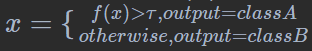
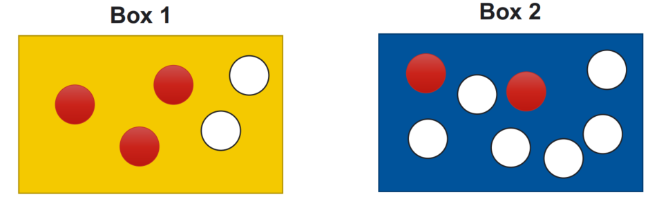
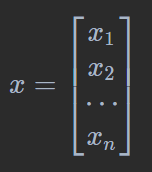
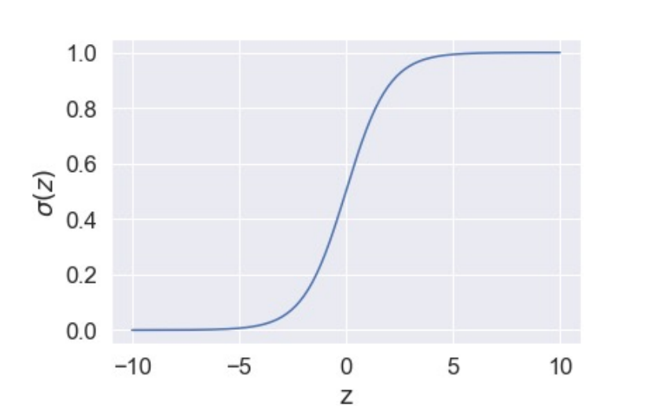

# 分类

预测目标变量的类别。

### 分类步骤：

1. 找到一个函数 $f(x)$ 使得

   
2. 评估(计算损失函数)
   $L(f)=\sum_n \delta(f(x^n) \neq y^n)$
3. 最小会损失函数
   $min(L(f))$

### 概率分类器：

二次判别分析（QDA）、线性判别分析（LDA）和朴素贝叶斯

### 概率

1. 先验概率: 从两个盒子中选一个球的概率
   $P(B_1)={5 \over 13}$
   $P(B_2)={8 \over 13}$
2. 条件概率: 已知选择的盒子时取得白球和红球的概率
   $P(white|B_1)={2 \over 5} \ P(red|B_1)={3 \over 5}$
   $P(white|B_2) = { 6 \over 8} \ P(red|B_2)={2 \over 8}$
3. 后验概率: 已知取得一个白球，从 $B_1$ 中取球的概率
   $P(B_1|white)={P(B_1)P(white|B_1) \over P(B_1)P(white|B_1) + P(B_2)P(white|B_2)}$
4. 概率分类原理: 给定一个x，预测它的类别 $C$
   $P(C_1|x) = {P(C_1)P(x|C_1) \over P(C_1)P(x|C_1) + P(C_2)P(x|C_2) + ... + P(C_n)P(x|C_n)}$

### 似然

从概率推参数的过程。

假设 $\theta$ 是环境参数（条件）， $X$ 是事件发生的结果。

计算概率 $P(X|\theta)$ ,在条件为 $\theta$ 下发生 $X$ 的概率。

计算似然 $L(\theta|X)$ ,在 $X$ 发生时，推断 $\theta$ 的值。

### 最大似然估计(Maximum Likelihood Estimate)

根据已知样本的结果，反推最大概率 $\theta$。

e.g.

在装有无限个红球和白球的盒子中随机取5个球，计算一次取球时，取得红球和白球的概率。

设 $P(red)=\theta \ \ \ \ \ \ \ \ \ P(white)=1-\theta$

抽取的样本为:

R W R R W

1. 获得这个样本的概率为: $L(\theta)=\theta^3(1-\theta)^2$
2. 求使得 $L(\theta)$ 最大的 $\theta$
   $ln L(\theta) =3ln\theta+2ln(1-\theta)$
   ${\partial lnL(\theta) \over \partial \theta} = {3\over\theta}-{2\over1-\theta} = 0$
   $\theta={3\over5}$

### 高斯分布

$f_{\mu,\Sigma}(x)={1 \over (2\pi)^{D/2}}{1\over|\Sigma|^{1/2}}e^{-{1\over 2}(x-\mu)^T\Sigma^{-1}(x-\mu)}$

其中,

$x$ 是长度为 $D$ 的向量

$\mu$ 是均值期望

$\Sigma$ 是协方差矩阵(其中的计算不是绝对值，是det计算)

$f_{\mu,\Sigma}(x)$ 概率密度

### 协方差

各个维度偏离其均值的程度，用于衡量两个变量的总体误差。

e.g.

其中，X和Y是样本的两个维度（特征）。

总共有n个样本。

### 协方差矩阵

设 $X=[x_1,x_2]^T$ 为2维随机变量。

则 $X$ 的协方差矩阵是：

其中 $c_{ij}=cov(x_i,x_j) \ ,i,j=1,2$

### 估计 $\mu$ 和 $\Sigma$

最大似然

$L(\mu,\Sigma)=f_{\mu,\Sigma}(x^1)f_{\mu,\Sigma}(x^2)f_{\mu,\Sigma}(x^3)...f_{\mu,\Sigma}(x^n)$

使其最大的 $\mu$ 和 $\Sigma$:

$\mu,\Sigma=max(L(\mu,\Sigma))$

$\mu={\sum^n_{i=1}x^i\over n}$

$\Sigma={\sum^n_{i=1}(x^i-\mu)(x^i-\mu)^T \over n}$

### QDA

$P(x| C_1)=f_{\mu_1,\Sigma_1}(x)$

$P(x|C_2)=f_{\mu_2,\Sigma_2}(x)$

### LDA

不同的类可能共享协方差矩阵 $Σ$

$L(\mu_1,\mu_2\Sigma)=f_{\mu_1,\Sigma}(x^1)f_{\mu_1,\Sigma}(x^2)...f_{\mu_1,\Sigma}(x^n) \times f_{\mu_2,\Sigma}(x^{n+1})f_{\mu_2,\Sigma}(x^{n+2})...f_{\mu_2,\Sigma}(x^{n+m})$

$\mu_1 = {\sum^n_{i=1}x_i \over n}$

$\mu_2={\sum^{m+n}_{i=n+1}x^i \over m}$

$\Sigma={n\over n+m}\Sigma_1 + {m \over n+m}\Sigma_2$

二者的区别在于，QDA的每个类别都可以拥有自己的协方差矩阵。当决策边界为非线性时，QDA通常会表现更好。

LDA通常在训练观察次数较少时（即需要减少方差时）表现更好。

### Naïve Bayes(朴素贝叶斯)

当x的所有特征都是**独立**的，使用朴素贝叶斯。

$P(x|C_1) = \prod^n_{i=1} P(x_i|C_1)$

这里很容易的连乘很容易造成下溢，使用一般使用对数似然:

$logP(x|C_1)= \sum^n_{i=1} logP(x_i|C_1)$

以上是生成模型(Generative), 分布的学习每个类，找到 $\mu_1,\mu_2,\Sigma$

生成模型预测的根据是联合概率P(X,Y)，”生成” (X,Y)样本的概率分布

以下的，包括逻辑回归是判别模型。

判别模型，直接找到 $\theta$

判别模型之所以称为“判别”模型 ，是因为其根据X “判别” Y；

生成模型优点:

由于有假设的概率分布，所以：

1. 需要更少的训练数据
2. 对噪音有更好的鲁棒性
3. 先验概率和田间概率可能来自于其他的同源估计（不需要自己完成）

### 二分类

$P(C_1|x)={P(x|C_1)P(C_1) \over P(x|C_1)P(C_1) + P(x|C_2)P(C_2)}={1 \over 1+{P(x|C_2)P(C_2) \over P(x|C_1)P(C_1)}}$

$= {1 \over 1+{e^{-z}}} = \sigma(z)$

其中 $z=ln{P(x|C_1)P(C_1) \over P(x|C_2)P(C_2)}$

这是一个sigmoid函数

