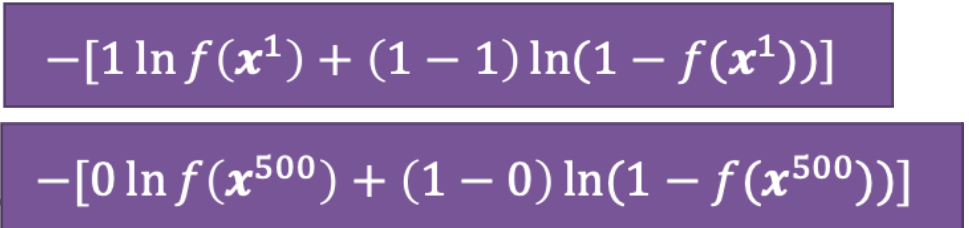

# 二分类逻辑回归

### 模型介绍

输入是特征向量 $x$ ，进行加权求和，再使用 sigmoid 激活函数得到一个0到1之间的值。

逻辑回归训练的过程是通过创造基于极大似然估计原理的损失函数(Loss Function)，并利用梯度下降法更新模型中的权重，使得损失函数达到最小。

$y_i = P(y_i=1) = {1 \over 1 + e^{\theta^Tx_i}}$

### 损失函数

对于逻辑回归模型，我们希望找到一个权重向量 $\theta$，使得在训练集中模型的输出与给定的标签越接近越好，及若标签为1，则模型输出值越接近1，若标签为0，则模型输出值越接近于0。

损失函数是负对数似然值(Negative Log Likelihood, NLL)。

设定模型为 $f_{\theta}(x)=\sigma(\theta^Tx)$

损失函数为 $L(f)=\sum_nC(f(x^n),y^n)$

$C(f(x^n),y^n)=-[y^nlnf_{\theta}(x^n)+(1-y^n)ln(1-f_{\theta}(x^n))]$

推导:

假设数据是基于 $f_{\theta}(x)=f_{\theta}(C_1|x)$

前两百个数据是第一类，后三百个数据是第二类

给定一个 $\theta$, 产生这个数据的可能性是

$L(\theta)=f_{\theta}(x^1)f_{\theta}(x^2)...f_{\theta}(x^{200})(1-f_{\theta}(x^{201}))...(1-f_{\theta}(x^{500}))$

可能性越大，偏差大越小，所以要找到使得这个式子最大的 $\theta^*$

$\theta^* = argmax_{\theta} L(\theta)$

$\theta^*=argmin_{\theta} (-lnL(\theta))$

所以

$-lnL(\theta)=-lnf_{\theta}(x^1)-lnf_{\theta}(x^2)-...-lnf_{\theta}(x^{200})-ln(1-f_{\theta}(x^{201}))-...-ln(1-f_{\theta}(x^{500}))$

$=-[y^{1}lnf(x^{1})+(1-y^{1})ln(1-f(x^{1}))]-[y^{2}lnf(x^{2})+(1-y^{2})ln(1-f(x^{2}))]...-[y^{500}lnf(x^{500})+(1-y^{500})ln(1-f(x^{500}))]$

$=\sum_n-[y^nlnf(x^n)+(1-y^n)ln(1-f(x^n))]$

### 梯度下降法计算权重

$-lnL(\theta)=\sum_n-[y^nlnf(x^n)+(1-y^n)ln(1-f(x^n))]$

$-{\partial lnL(\theta) \over \partial \theta_i}=\sum_n-[y^n {\partial lnf(x^n) \over \partial \theta_i}+(1-y^n){\partial ln(1-f(x^n)) \over \partial \theta_i}]$

其中,根据链式法则

${\partial lnf(x^n) \over \partial \theta_i} = {\partial lnf(x^n) \over \partial z}{\partial z \over \partial \theta_i}$

${\partial ln(1-f(x^n)) \over \partial \theta_i} = {\partial ln(1-f(x^n)) \over \partial z}{\partial z \over \partial \theta_i}$

由于 $f(x^n)=\sigma(z)={1 \over 1+e^{-z}}$, $z=\theta^Tx$

${\partial lnf(x^n) \over \partial z}={\partial ln \sigma(z) \over \partial \sigma(z)}{\partial \sigma(z) \over \partial z}={1 \over \sigma(z)}\sigma(z)(1-\sigma(z))=1-\sigma(z)=（1-f(x^n)）$

${\partial z \over \partial \theta_i}=x_i$

所以

${\partial lnf(x^n) \over \partial \theta_i}=(1-f(x^n))x^n_i$

同理

${\partial ln(1-f(x^n)) \over \partial z} ={\partial ln(1-\sigma(z))\over \partial \sigma(z)}{\partial \sigma(z) \over \partial z}={-1 \over 1-\sigma(z)}{\sigma(z)(1-\sigma(z))}=-\sigma(z)$

所以

${\partial ln(1-f(x^n)) \over \partial \theta_i} =-f(x^n)x^n_i$

综上所述可知，$\theta_i$ 当前的梯度是:

$-{\partial lnL(\theta) \over \partial \theta_i}=\sum_n-(y^n-f(x^n))x^n_i$

所以更新 $\theta_i$ 使用:

这种形式叫做交叉熵(cross entropy)

$\theta_i=\theta_i-\eta\sum_n-(y^n-f(x^n))x^n_i$

### 逻辑回归为什么可以用来分类？

逻辑回归是回归的一种，由于其预测的值是一个二项分布的，也就是说预测0或1。

所以可以用来解决二分类问题。

### 多分类

在二分类问题中，我们使用sigmoid函数来进行分类，但是只能分为两类。

在多分类问题中，我们使用softmax函数，又称**归一化指数函数**。

它是二分类函数sigmoid在多分类上的推广，目的是将多分类的结果以概率的形式展现出来。

通过Softmax函数就可以将多分类的输出值转换为范围在[0, 1]和为1的概率分布。

$Softmax(z_i)={e^{z_i} \over \sum^n_i=1 e^{z_i}}$

引入指数函数对于Softmax函数是把双刃剑

**引入指数形式的优点**：

指数函数曲线呈现递增趋势，最重要的是斜率逐渐增大，也就是说在x轴上一个很小的变化，可以导致y轴上很大的变化。这种函数曲线能够将输出的数值拉开距离。

**引入指数形式的缺点**:

指数函数的曲线斜率逐渐增大虽然能够将输出值拉开距离，但是也带来了缺点，当值非常大的话，计算得到的数值也会变的非常大，数值可能会溢出。

当然针对数值溢出有其对应的优化方法，将每一个输出值减去输出值中最大的值。

**改进**

$D=max(z)$

$softmax(z_i)={e^{z_i}-D \over \sum^n_{i=1}e^{z_i}-D}$

**交叉熵损失函数**

$P_i=Softmax(z_i)={e^{z_i}\over \sum^n_{i=1}e^{z_i}}$ ，其中i表示输出节点的编号。

$L=-\sum^n_{i=1}y_ilnP_i$

对于分类任务来说，真实的样本标签通常表示为one-hot的形式。

比如对于三分类来说，真实类别的索引位置为1，也就是属于第二个类别，那么使用one-hot编码表示为[0, 1, 0]，也就是仅正确类别位置为1，其余位置都为0。

### 逻辑回归的局限

逻辑回归的局限性主要在于无法通过一个函数来解决异或问题。

一个解决方法是可以通过转换特征空间方法解决异或问题，但是不能总是通过依赖手工的方法来找到一个好的转换，这就违背了机器学习的本质。

这个问题可以通过神经网络来解决。

# 总结

sigmoid 函数是: $\sigma(z)={1 \over 1+e^{-z}}$

导数形式是: $\sigma^{'}(z)=\sigma(z)(1-\sigma(z))$

交叉熵作为损失函数: $L=-\sum^n_{i=1}y_ilnP_i$ 其中 $y_i$ 是样本在第i类的真实概率（0或1）， $P_i$ 是预测概率。

二分类的交叉熵损失函数: $L=-y_1lnP_1-(1-y_1)ln(1-P_1)$ 因为是二分类问题，所以不是第一类的概率是 $1-P_1$

sigmoid 损失函数是: $L(\theta)=-\sum_n[y^nlnf_{\theta}(x^n)+(1-y^n)ln(1-f_{\theta}(x^n))]$

sigmoid 损失函数求导（梯度）: $-{\partial lnL(\theta) \over \partial \theta_i}=\sum_n-(y^n-f(x^n))x^n_i$

softmax 损失函数求导（梯度）: ${\partial y_i \over \partial z_j}=\{{ P_i(1-P_i), j=i\atop -P_jP_i, j\neq i}$
