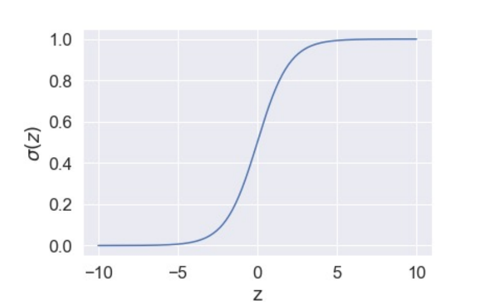

# 二分类逻辑回归

### 模型介绍

输入是特征向量 $x$ ，进行加权求和，再使用 sigmoid 激活函数得到一个0到1之间的值。

优点：无需假设数据分布，避免了假设分布不准确造成的问题。

逻辑回归训练的过程是通过创造基于极大似然估计原理的损失函数(Loss Function)，并利用梯度下降法更新模型中的权重，使得损失函数达到最小。

sigmoid函数： $\sigma(z)={1 \over 1+e^{-z}}$ 所以有

$y_i = P(y_i=1|x_i) = {1 \over 1 + e^-{\theta^Tx_i}}$

该式子可以看作：

$ln {y \over 1-y}=\theta^Tx$

其中 $y\over 1-y$ 表示的几率(odds)，即样本是正例的可能性比样本是反例的可能性。

表示的是x作为正例的相对可能性。

### 损失函数

对于逻辑回归模型，我们希望找到一个权重向量 $\theta$，使得在训练集中模型的输出与给定的标签越接近越好，及若标签为1，则模型输出值越接近1，若标签为0，则模型输出值越接近于0。

这里考虑二分类问题。

${y\over 1-y} = {P(y=1|x) \over P(y=0|x)} = e^{\theta^Tx} => P(y=1|x) = P(y=0|x) e^{\theta^Tx}$

由于 $P(y=1|x)+P(y=0|x)=1$ 所以:

$P(y=1|x)=P(y=0|x) e^{\theta^Tx}=(1-P(y=1|x))e^{\theta^Tx} => P(y=1|x) = {e^{\theta^Tx} \over 1+e^{\theta ^Tx}}$

$P(y=0|x)={1\over 1+ e^{\theta^ Tx}}$

所以一个样本分类是**正确的概率**:

(1) 若果样本是正例(y=1)，那它分类正确的概率是： $P(y=1|x)$ ,不正确的概率是 $P(y=0|x)$

(2) 若果样本是反例(y=0)，那它分类正确的概率是： $P(y=0|x)$ ,不正确的概率是 $P(y=1|x)$

一个样本是正确的概率是： $P= yP(y=1|x) + (1-y)P(y=0|x)$

由于y的值是0或者1，那么如果样本本身是正例则 $P=1 * P(y=1|x)=P(y=1|x)$

如果样本本身是反例则 $P=1 * P(y=0|x)=P(y=0|x)$

#### 使用最大似然

与其他分类器同理，对整个训练集采用最大似然方法。

$Likelihood = P_1P_2...P_n$

由于累乘可能溢出且不方便计算，转换为log累加。

$ln(Likelihood)=ln(P_1)+ln(P_2)+...+ln(P_n)$

将 P 的公式代入：

$ln(Likelihood) = \sum^n_{i=1}ln(y_i*P(y_i=1|x_i)+(1-y_i)*P(y_i=0|x_i))$

$=\sum^n_{i=1}ln(y_i* \sigma(x_i) + (1-y_i)(1-\sigma(x_i)))$

对这个式子两边添加符号可以获得一个求最小值的函数，可以作为损失函数。

损失函数： $L(\theta) = -ln(Likelihood) = \sum^n_{i=1}-[y_i * ln(\sigma(x_i))+(1-y_i)*ln((1-\sigma(x_i)))]$

**注意**：这里的损失函数看上去是难以处理的，但是由于y的取值特性，中括号中最终只会留下来一项。

**方法**：假设 $f_{\theta}(x) = P(y=1|x)$

假设前两百个数据是第一类，后三百个数据是第二类

给定一个 $\theta$, 产生这个数据的可能性是

$L(\theta)=f_{\theta}(x^1)f_{\theta}(x^2)...f_{\theta}(x^{200})(1-f_{\theta}(x^{201}))...(1-f_{\theta}(x^{500}))$

可能性越大，偏差大越小，所以要找到使得这个式子最大的 $\theta^*$

$\theta^* = argmax_{\theta} L(\theta)$

$\theta^*=argmin_{\theta} (-lnL(\theta))$

所以

$-lnL(\theta)=-lnf_{\theta}(x^1)-lnf_{\theta}(x^2)-...-lnf_{\theta}(x^{200})-ln(1-f_{\theta}(x^{201}))-...-ln(1-f_{\theta}(x^{500}))$

$=-[y^{1}lnf(x^{1})+(1-y^{1})ln(1-f(x^{1}))]-[y^{2}lnf(x^{2})+(1-y^{2})ln(1-f(x^{2}))]...-[y^{500}lnf(x^{500})+(1-y^{500})ln(1-f(x^{500}))]$

$=\sum_n-[y^nlnf(x^n)+(1-y^n)ln(1-f(x^n))]$

损失函数为 $L(f)=\sum_nC(f(x^n),y^n)$

$C(f(x^n),y^n)=-[y^nlnf_{\theta}(x^n)+(1-y^n)ln(1-f_{\theta}(x^n))]$

其实是 $L=-\sum^n_{i=1}y_ilnP_i$

### 梯度下降法计算权重

$-lnL(\theta)=\sum_n-[y^nlnf(x^n)+(1-y^n)ln(1-f(x^n))]$

$-{\partial lnL(\theta) \over \partial \theta_i}=\sum_n-[y^n {\partial lnf(x^n) \over \partial \theta_i}+(1-y^n){\partial ln(1-f(x^n)) \over \partial \theta_i}]$

其中,根据链式法则

${\partial lnf(x^n) \over \partial \theta_i} = {\partial lnf(x^n) \over \partial z}{\partial z \over \partial \theta_i}$

${\partial ln(1-f(x^n)) \over \partial \theta_i} = {\partial ln(1-f(x^n)) \over \partial z}{\partial z \over \partial \theta_i}$

由于 $f(x^n)=\sigma(z)={1 \over 1+e^{-z}}$, $z=\theta^Tx$

${\partial lnf(x^n) \over \partial z}={\partial ln \sigma(z) \over \partial \sigma(z)}{\partial \sigma(z) \over \partial z}={1 \over \sigma(z)}\sigma(z)(1-\sigma(z))=1-\sigma(z)=1-f(x^n)$

${\partial z \over \partial \theta_i}=x_i$

所以

${\partial lnf(x^n) \over \partial \theta_i}=(1-f(x^n))x^n_i$

同理

${\partial ln(1-f(x^n)) \over \partial z} ={\partial ln(1-\sigma(z))\over \partial \sigma(z)}{\partial \sigma(z) \over \partial z}={-1 \over 1-\sigma(z)}{\sigma(z)(1-\sigma(z))}=-\sigma(z)$

所以

${\partial ln(1-f(x^n)) \over \partial \theta_i} =-f(x^n)x^n_i$

综上所述可知， $\theta_i$ 当前的梯度是:

$-{\partial lnL(\theta) \over \partial \theta_i}=\sum_n-(y^n-f(x^n))x^n_i$

所以更新 $\theta_i$ 使用:

这种形式叫做交叉熵(cross entropy)

$\theta_i=\theta_i-\eta\sum_n-(y^n-f(x^n))x^n_i$

### 逻辑回归为什么可以用来分类？

逻辑回归是回归的一种，由于其预测的值是一个二项分布的，也就是说预测0或1。

所以可以用来解决二分类问题。
