# 多分类

### 多分类和二分类的区别

二分类遵循伯努利（Bernoulli）分布，模型判断结果是yes或no（0或1）。

多分类遵循multinoulli分布，判断模型是很多类别中的一类。

### 多分类策略

1. 有一些多分类器是天生的，例如决策树、朴素贝叶斯。他们本身就可以进行多分类。
2. 有一些分类器是天生二分类的，例如逻辑回归、支持向量机。有两种策略使得他们可以完成多分类问题。
   1. 训练一个二分类器的集合
   2. 扩展逻辑回归

### 训练二分类器集合

**One-vs-One：**

训练 $N(N-1)/2$ 个二分类器。每两个类别之间训练一个分类器。通过投票来选择最后的类别。

例子：

假设有三个类，分别是 狮子、马、猴子。

则需要训练 $3\times(3-1)/2=3$ 个分类器，分别是 狮子-马、 狮子-猴子、 马-猴子。

**注意：** 每个分类器只能看到他们需要的数据，即狮子-马分类器只能看到训练集中的狮子和马的样本，而不能看到猴子的样本。

假设样本空间如下：

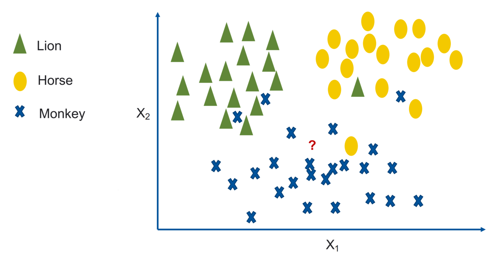

假设狮子-马分类器如下：

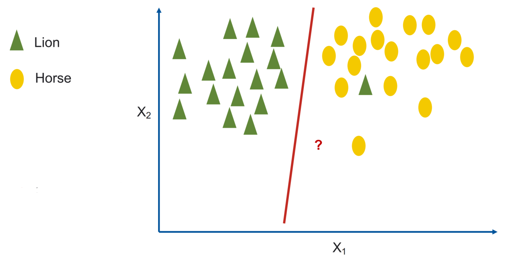

新样本被划分为马，则马获得一票。

假设马-猴子分类器如下：

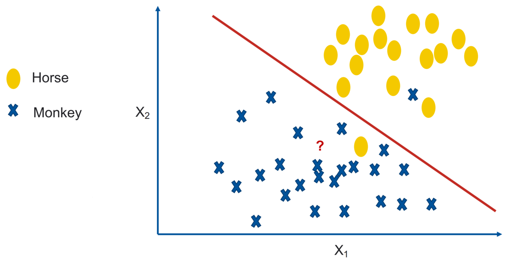

新样本被划分为猴子，则猴子获得一票。

假设狮子-猴子分类器如下：

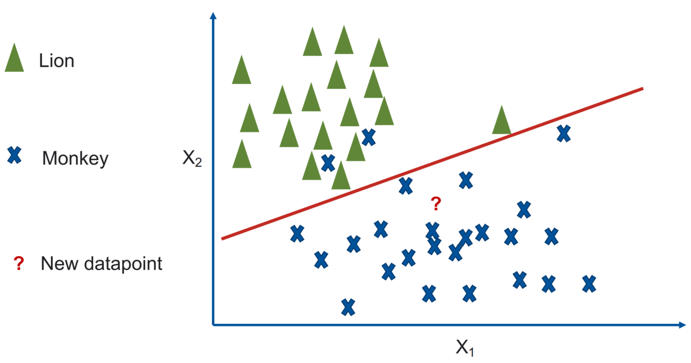

新样本被划分为猴子，则猴子获得一票。

**预测：** 马获得1票，猴子获得2票。则新样本被预测为猴子。

**注意：** 如果出现平票，则随机选择一个类别。

**One-vs-all(One-vs-rest)：**

训练 $N$ 个分类器。即每个类别对其他所有类别的分类器。输出最可信的类别。

例子：

假设狮子-非狮子分类器如下：

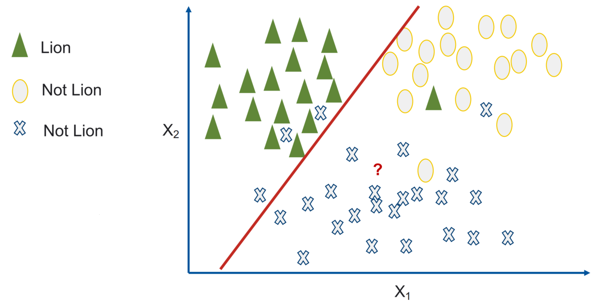

新样本不太可能是狮子。

假设马-非马分类器如下：

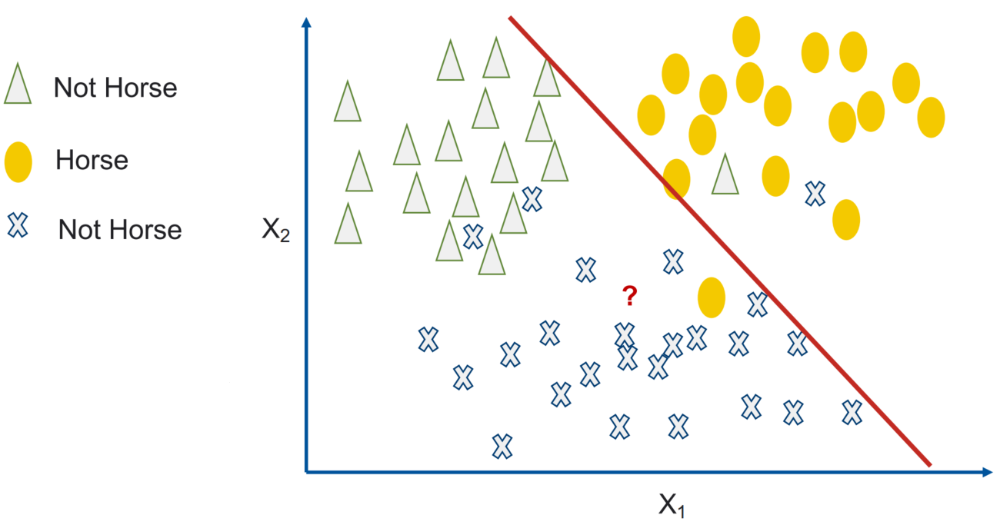

新样本不太可能是马。

假设猴子-非猴子分类器如下：

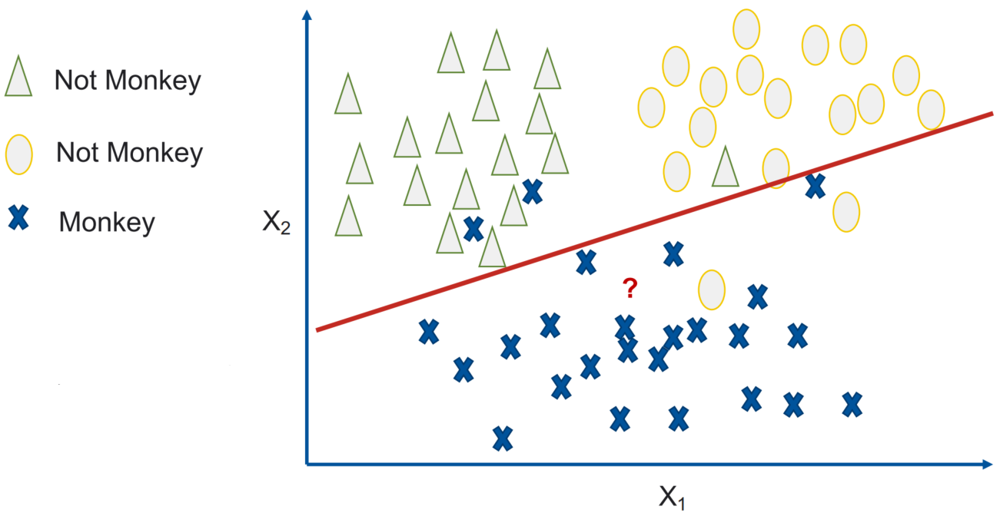

新样本很可能是猴子。

**预测：** 新样本不太可能是马和狮子，新样本可能是猴子，所以预测结果是猴子。

**总结：**

两者都很常用，但是选择哪一种模型需要考虑数据集。

两者找到的都不是最优解。

### 扩展逻辑回归（将sigmoid推广到多分类）

**softmax激活函数：**

softmax函数用于多分类。

它是二分类函数sigmoid在多分类上的推广，目的是将多分类的结果以概率的形式展现出来。

通过Softmax函数就可以将多分类的输出值转换为范围在[0, 1]和为1的概率分布。

如下：

$Softmax(z_c)={e^{z_c} \over \sum^n_{i=1} e^{z_i}}$

$n$ 是类别的数量， $z$ 是类别 $c$ 下的线性回归输出。

所以这个线性模型是：

$y_c={e^{X^T\theta_c}\over \sum^n_i{e^{X^T\theta_i}}}$

模型仍然是线性的。

**标签：**

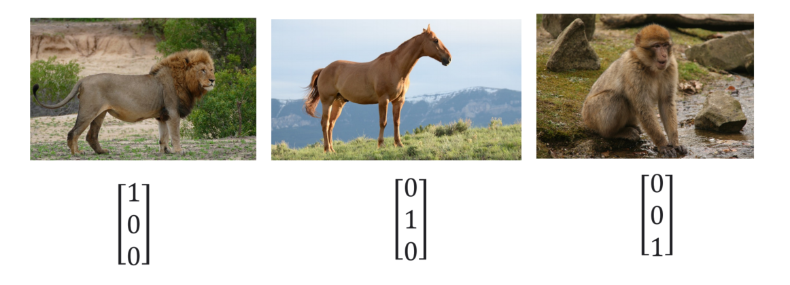

$y$ 的维度是类别的数量。

**权重：**

假设输入的维度是4。

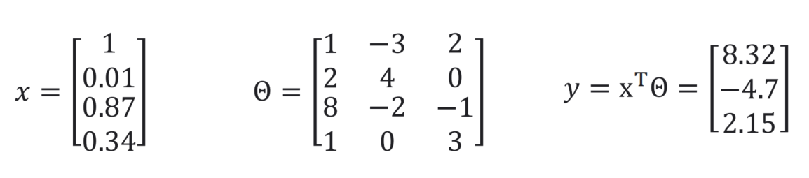

$\theta$ 的大小是 $x的维度 \times 类别的数量$ 。

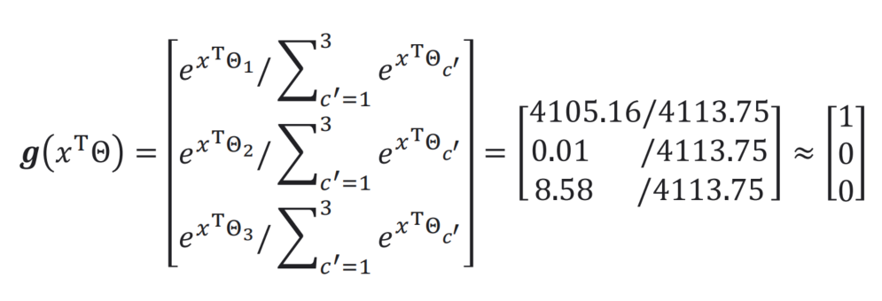

使用softmax函数归一，可知这个样本是狮子。

**softmax函数改进：**

引入指数函数对于Softmax函数是把双刃剑

**引入指数形式的优点**：

指数函数曲线呈现递增趋势，最重要的是斜率逐渐增大，也就是说在x轴上一个很小的变化，可以导致y轴上很大的变化。这种函数曲线能够将输出的数值拉开距离。

**引入指数形式的缺点**:

指数函数的曲线斜率逐渐增大虽然能够将输出值拉开距离，但是也带来了缺点，当值非常大的话，计算得到的数值也会变的非常大，数值可能会溢出。

当然针对数值溢出有其对应的优化方法，将每一个输出值减去输出值中最大的值。

**改进**

$D=max(z)$

$softmax(z_i)={e^{z_i}-D \over \sum^n_{i=1}e^{z_i}-D}$

**交叉熵损失函数**

$P_i=Softmax(z_i)={e^{z_i}\over \sum^n_{i=1}e^{z_i}}$ ，其中i表示类别的编号。

假设有N个样本，C个类别，损失函数是：

$L=-{1\over N} \sum^C_{i=1} \sum^N_{j=1} y_jlnP_j$

**求导**

softmax函数

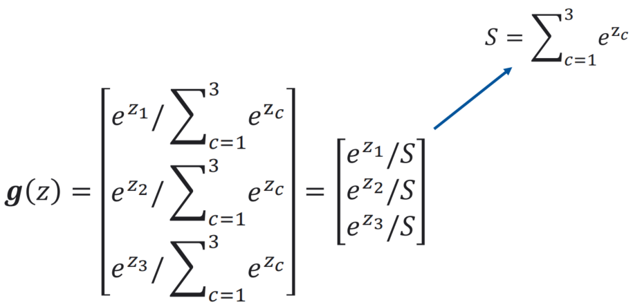

我们想要找到的偏导是：

${\partial g_i \over \partial z_i} = {\partial {e^{z_i} \over \sum^C_{i'=1}e^{z_{i'}}} \over \partial z_j} = {\partial {e^{z_i} \over S} \over \partial z_j}$

由于：

$g(z_i) = {e^{z_i} \over \sum^C_{c=1}e^{z_c}}$ 是 $y={a(x) \over b(x)}$ 类型，所以它的导数是 $y'={a'(x)b(x) - b'(x)a(x) \over b(x)^2}$

所以：

${\partial {e^{z_i} \over S} \over \partial z_j} = {{\partial e^{z_i} \over \partial z_j}S - {\partial S \over \partial z_j}e^{z_i} \over S^2}$

当 $i=j$ 的时候:

${{\partial e^{z_i} \over \partial z_j}S - {\partial S \over \partial z_j}e^{z_i} \over S^2} = {{\partial e^{z_i} \over \partial z_i}S - {\partial S \over \partial z_i}e^{z_i} \over S^2} = {e^{z_i}S-e^{z_i}e^{z_i} \over S^2} = {e^{z_i} \over S} \times {S - e^{z_i} \over S} = g(z_i)(1-g(z_i))$

当 $i\neq j$ 的时候:

${{\partial e^{z_i} \over \partial z_j}S - {\partial S \over \partial z_j}e^{z_i} \over S^2} = {{\partial e^{z_i} \over \partial z_j}S - {\partial S \over \partial z_j}e^{z_i} \over S^2} = {0 - e^{z_j}e^{z_i} \over S^2} = -g(z_i)g(z_j)$

### 逻辑回归的局限

逻辑回归的局限性主要在于无法通过一个函数来解决异或问题。

一个解决方法是可以通过转换特征空间方法解决异或问题，但是不能总是通过依赖手工的方法来找到一个好的转换，这就违背了机器学习的本质。

这个问题可以通过神经网络来解决。

# 总结

sigmoid 函数是: $\sigma(z)={1 \over 1+e^{-z}}$

导数形式是: $\sigma^{'}(z)=\sigma(z)(1-\sigma(z))$

交叉熵作为损失函数: $L=-\sum^n_{i=1}y_ilnP_i$ 其中 $y_i$ 是样本在第i类的真实概率（0或1）， $P_i$ 是预测概率。

sigmoid 损失函数是: $L(\theta)=-\sum_n[y^nlnf_{\theta}(x^n)+(1-y^n)ln(1-f_{\theta}(x^n))]$

sigmoid 损失函数求导（梯度）: $-{\partial lnL(\theta) \over \partial \theta_i}=\sum_n-(y^n-f(x^n))x^n_i$

softmax 损失函数求导（梯度）:

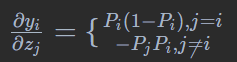
