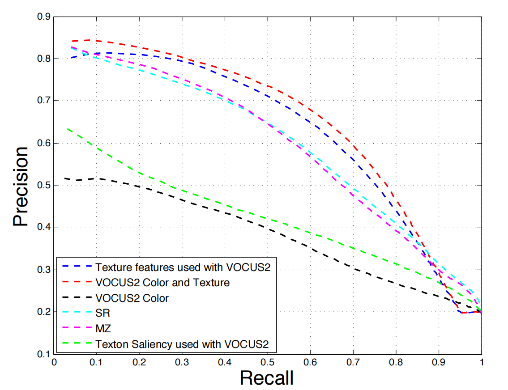
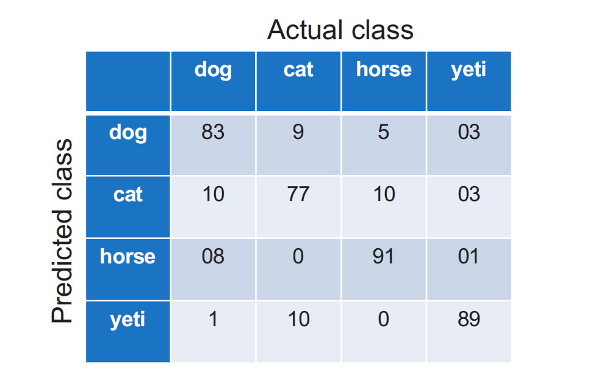
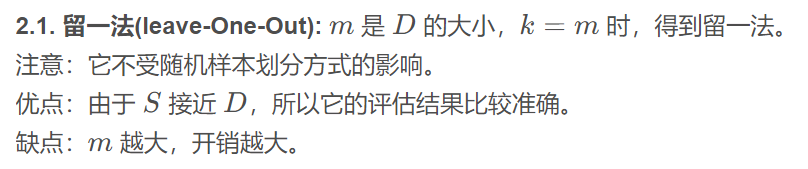

# 模型评估

### 分隔数据集

数据集被分隔为训练集和测试集。

测试集不能用于训练或者其他非测试性能的行为。

测试数据是用于报告最终模型的性能的。

**对训练集的评估是乐观的。**

### 验证集和测试集

**验证集：**

不参加训练但是可以多次使用去调整模型参数。

**测试集：**

测试集理想地只使用一次，使用我们找到的最佳参数。

验证数据集（validation dataset）是模型训练过程中留出的样本集，它可以用于调整模型的超参数和评估模型的能力。

但测试数据集（test dataset）不同，虽然同是模型训练过程中留出的样本集，但它是用于评估最终模型的性能，帮助对比多个最终模型并做出选择。

### 回归的性能评估

#### 回归的损失函数:

1. 残差平方和(Residual Sum of Squares):
   $RSS(\theta)=\sum(y-y_p)^2$
2. 绝对误差和(Sum of Absolute Errors):
   $SAE(\theta)=\sum(y-y_p)$
3. 决定系数(Coefficient of determination):
   $R(\theta)=1-{\sum_i(y^i-y^i_p)^2 \over \sum_i(y^i-y_m)^2}$
4. 均方误差(Mean Squared Error):
   $MSE(\theta)={1 \over N}\sum(y-y_p)^2$
5. 绝对平均误差(Mean Absolute Error):
   $MAE(\theta)={1\over N}\sum(y-y_p)$
6. 均方根误差(Root Mean Squared Error):
   $RMSE(\theta)={\sqrt MSE(\theta)}$

### 二分类的性能评估

分类与回归的不同之处在于，所有的误差都被相同地处理。

**正确的分类：** True Positives + True Negatives

**错误的分类:**  False Positives + False Negatives

可以被简写为:

TP, TN, FP, FN

P = 所有正样本的数量 = TP + FN

N = 所有负样本的数量 = TN + FP

我们经常使用**精度**来衡量：

$acc={(TP + TN) \over P+N}$ 即正确分类数除以总数

**错误率(Error rates)**：

1. 假正率(False Positive Rate)= ${FP \over total \ negatives} = {FP \over (TN+FP)}$ ,即负样本错误分类的比例
2. 假负率(False Negative Rate)= $FN \over (TP+FN)$ ，即正样本错误分类的比例

**特异性和敏感性(Specificity and sensitivity)**：

1. 特异性(Specificity): 1 - FPR (True Positive Rate)
2. 敏感性(sensitivity): 1 - FNR (True Negative Rate, Recall)

**精度和召回率(Precision and recall)**:

1. 精度(Precision): TP / (TP+FP)
2. 召回率(recall): TP / (TP+FN)
3. F1分数(F1-score): 2 * (Precision * Recall) / (Precision + Recall)

除了F1-score，其他的都是成对的冲突参数。

**PR曲线（Precision-Recall curve）**：

曲线下方面积越大，性能越好。

平均精度（Average Precision ，AP）是PR曲线下的面积。

### 多分类的性能评估

#### 多分类的两种实现：

1. 一对多（one vs all）:
   假设有 N 个类，则训练 N 个而分类器，当接受一个样本是，将其传入每个分类器，选择，其中概率最大的类别。
2. 一对一（one vs one）:
   假设有 N 个类，在每两个类别之间训练一个分类器，即有 N(N-1)/2 个分类器，总共得到 N(N-1)/2 个分类结果，选择得票率最高的类别。
   如果平局，则随机选择。

#### 混淆矩阵(confusion matrix):

正确标签与预测标签的表包含每个标签的比例。

对角线表示正确的检测。

非对角线条目表示错误。

### 数据

在分类中，使用分层抽样来确保类在两个数据集中的表示一致。

#### 数据泄露

测试集很容易数据泄露，即其中的数据出现在训练集中。

### k折交叉验证（k-fold cross validation）

将数据集分成k个大小相同的子集。

训练k次，每次使用k-1个子集训练，用剩下的一个进行测试。

最后，将结果平均。

注意： 通常要进行p次，即p次k折交叉验证。

k值越大，结果越可靠。

但极端情况下：留一交叉验证

