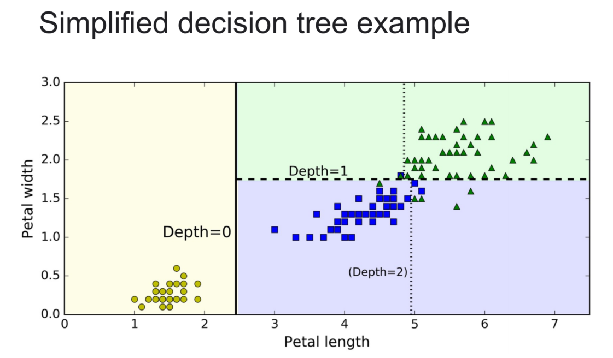

# 决策树

决策树是一种基于树形结构的有监督学习算法，用于解决分类和回归问题。它的核心思想是通过一系列的判断来对数据进行分类或者预测。

决策树由节点和边组成，每个节点代表一个特征或属性，每个边代表一个决策规则或者结果。在分类问题中，决策树通过一系列的问题和条件对数据进行分类，最终到达叶子节点，叶子节点代表最终的分类结果。在回归问题中，决策树同样使用一系列的条件来预测目标变量的值。

### 决策树

### 划分选择

决策树的关键是如何选择最优的划分属性，我们希望决策树的分支节点所包含的样本属于同一类。即节点的“纯度（purity）”越来越高。

1. 对每个特征的每个值进行切分比较，选择**最好**(分类：信息增益、增益率、基尼系数)的分隔。
2. 从包含所以属性的单个节点开始，选择**最好**的节点划分数据。
3. 重复第二步，直到不能划分。

### 正则化决策树（剪枝）

1. 预剪枝：
   在决策树生成过程中，对每个节点在划分前进行估计，若当前节点不能带来性能提升，则停止设置为叶子节点，并将其下属最多的类别作为该节点的分类结果。
   例子：使用最大深度、最先信息增益
2. 后剪枝：
   先训练一颗完整的决策树，然后自底向上对非叶子节点考察，若该非叶子节点对应的子树替换为叶子节点可以带来性能提升，则替换。

区别：预剪枝训练时间短，但是容易欠拟合。后剪枝训练时间长，但是欠拟合风险小。

### 信息熵（香农熵）

是度量样本集合纯度的一种常用指标。

$Ent(D)=-\sum_{c=1}^CP(c)logP(c)$

一个纯集合的熵为零。

一个不纯的集合将具有很高的熵。

### 信息增益

用属性a对样本即D划分所获得的“信息增益”，即香农熵的减小量。

$IG(D, a)=Ent(D)-Ent(D|a)$

### 增益率

信息增益可能对可取值数目较多的属性有所偏好，为了减少这种偏好带来的不利影响，“增益率”被用作选择属性的标准。

$IG {\_ ratio}=(D, a) = {IG(D,a)\over IV(a)}$

其中，

$\operatorname{IV}(A) = -\sum_{v=1}^V\frac{|D^v|}{|D|}\log\frac{|D^v|}{|D|}$

IV就是信息熵。

### 基尼系数

反映了从数据集随机抽取两个样本，他们不是同一类的概率。

基尼纯度： $Gini(D)=\sum_cP(c)P(¬c)=1-\sum_cP(c)^2$

基尼系数： $Gini{\_index}(D, a)=\sum_{v=1}^V\frac{|D^v|}{|D|}Gini(D^v) $

### 随即森林

学习一组决策树，每个树都使用随机的训练集的一部分，同时使用一部分随机的特征。

选择投票最多的类别为预测类别。

对于回归问题则使用平均值。

### 决策树回归

基本步骤与分类决策树一致。

子节点返回其下样本的平均值。

通常使平方差作为划分。
