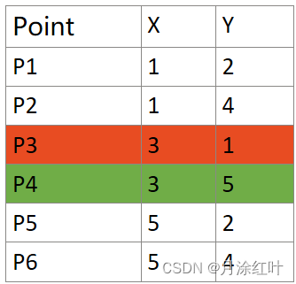
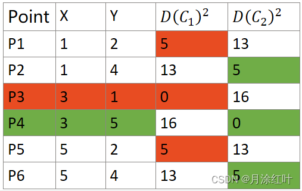
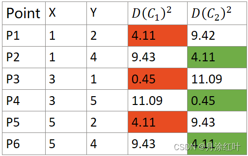
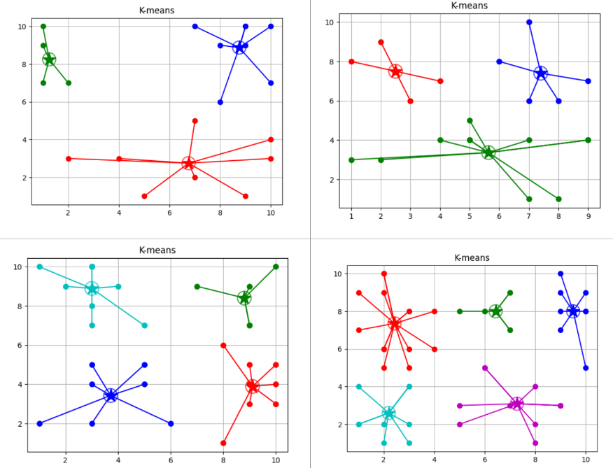

# K-Means聚类算法

K-Means算法是机器学习中一个非常简单且使用的聚类算法。其只具备一个超参数K，代表着样本的类别数。
假设k=2则表示我们希望将样本分为两类，另外k-means能够自主寻找样本数据的内部结构。
该算法是基于**假设**：特征空间中相近的两个样本很可能属于同一类别。

因为它所使用的数据不带有标签，所以毫无疑问是一种**无监督学习**方法。

其具备以下**优点**

1. 可解释性好。
2. 实现简单。
3. 分类效果不错。

但是也存在一些**缺点**：

1. 准确度不如监督学习。
2. 对K值的选择很敏感。

### 算法步骤

1. 先定义有多少个簇/类别(cluster)，即确定K值。
2. 将每个簇心（中心）随机定在样本点上。
3. 每个样本关联到最近的簇心上。
4. 重新计算每个簇的簇心位置（取每个点坐标的平均值）。
5. 更改簇心。
6. 不停重复，直到簇心不变。

### 例子

**1. K=2选取簇心**

随机选择P3和P4作为簇心。

P3是第一类的中心(红色)。
P4是第一类的中心(绿色)。

**2. 计算每个点到簇心的距离**

此处 $D(C_n)^2$ 表示样本点到第n个簇心的距离的平方（简化计算）。

其中点 P1, P3, P5是一类， P2, P4, P6是另一类。

**3. 更新簇心**

$C_1 = ({x_1+x_3+x_5 \over 3}, {y_1+y_3+y_5 \over 3})=(3, 1.67)$

$C_2 = ({x_2+x_4+x_6 \over 3}, {y_2+y_4+y_6 \over 3})=(3, 4.33)$

**4. 再次计算每个点到簇心的距离。**

所有样本所属的簇没有改变，所有簇心不变，循环结束，分类完成。

### 结果

统一数据集下，不同K的聚类结果。
